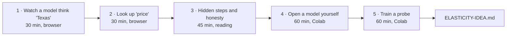

# Interpretability: start here

Interpretability means looking inside a model at the steps it takes, not only at what it says.
From an alignment view, the reason is simple: a model can reach an answer by steps that never
show in its words. If we want to know why it said something, we have to look.

This is a path in five small steps. Each takes under an hour. Every tool is free. Steps 1 to 3
need only a browser. Steps 4 and 5 use a free Google Colab notebook. You can stop after any step
and still have learned one real thing.

Every link below was opened on Oct 8 2026 and worked without an account.

---

## 1. Tonight: watch a model think "Texas" (about 30 minutes)

Open this graph:
[the capital of the state containing Dallas](https://www.neuronpedia.org/gemma-2-2b/graph?slug=gemma-fact-dallas-austin)
(Neuronpedia's circuit tracer, on Google's open model Gemma 2 2B).

The prompt is "Fact: The capital of the state containing Dallas is". The model answers "Austin".

What to do:

- Wait for the graph to load. The words of the prompt run along the bottom. The model's layers
  run upward.
- In the lower panel, find the labelled groups: "capital", "state", "Texas",
  "say a capital city", and the output "Austin".
- Hover over a node in the "Texas" group. The right panel shows the text where that feature
  fires most.

What to notice: the word "Texas" is not in the prompt and not in the answer. Yet a "Texas" step
sits in the middle, between "Dallas" and "Austin". The model did a two-hop step (Dallas, then
Texas, then its capital) inside, and wrote down only the end. The original paper also finds a
shortcut path from "Dallas" straight to "Austin", so both routes run at once.

If you want ten more minutes, read the paper's own version of this example:
[Introductory Example: Multi-step Reasoning](https://transformer-circuits.pub/2025/attribution-graphs/biology.html#dives-tracing)
(Anthropic, "On the Biology of a Large Language Model", Mar 2025; it studies Claude 3.5 Haiku).

**Why this matters for alignment:** the model took a step it never said out loud. If a model can
do that for a harmless fact, it can do it for other things, and reading its insides is one way
to check its stated reasoning against its real one.

---

## 2. Look up "price" in a model's dictionary (about 30 minutes)

Open [Neuronpedia's explanation search for "price"](https://www.neuronpedia.org/search-explanations/?q=price).

A "feature" is a direction inside the model that tends to fire on one kind of thing. Each one
has a short label, written automatically by another AI model. Labels can be wrong.

What to do:

- Scroll the results. Click two or three features.
- For each one, read the examples where it fires most. Ask: does the label fit these examples?

What to notice: there is no single "price" feature. On Oct 8 2026 the search showed separate
features for price increases in the news, for amounts after "around $", for pricing theory, and
for the strike price of a financial contract. "Price" inside the model looks like a family of
related things, not one thing. Keep this in mind for the elasticity note.

(Neuronpedia's other search, "Search via Inference", returned a server error on Oct 8 2026. The
explanation search above worked.)

**Why this matters for alignment:** the labels are written by an AI about an AI. Checking them
by hand against the examples is the basic habit of the field.

---

## 3. Hidden steps and honesty (about 45 minutes, reading)

Read two sections of the same paper:

- [Chain-of-thought Faithfulness](https://transformer-circuits.pub/2025/attribution-graphs/biology.html#dives-cot)
- [Uncovering Hidden Goals in a Misaligned Model](https://transformer-circuits.pub/2025/attribution-graphs/biology.html#dives-misaligned)

What to notice: in the first section, the written working sometimes matches what happens inside
and sometimes does not. In one case the model appears to work backward from an answer the user
suggested. In the second, the authors study a model trained to have a hidden goal, and look for
that goal inside it.

Read slowly and skip the method boxes. The paper's own
[Limitations](https://transformer-circuits.pub/2025/attribution-graphs/biology.html#limitations)
section is worth five minutes: these graphs explain part of what the model does, not all of it.

**Why this matters for alignment:** these are the authors' own examples of a model's words and
its insides coming apart, which is the case interpretability is meant to catch.

---

## 4. Open a model yourself (about 60 minutes, free Colab)

Open ARENA's chapter
[1.2 Intro to Mechanistic Interpretability](https://learn.arena.education/chapter1_transformer_interp/02_intro_mech_interp/)
and do only the first parts: "Setup code", "Loading and Running Models", "Tokenization" and
"Caching all Activations". ARENA is a free curriculum; the
[course home](https://learn.arena.education/) explains how to run it in Colab.

If ARENA feels heavy tonight, the
[TransformerLens Main Demo in Colab](https://colab.research.google.com/github/TransformerLensOrg/TransformerLens/blob/main/demos/Main_Demo.ipynb)
covers the same ground. Run its cells in order and stop after the activation cache.

What to notice: the model's insides are arrays of numbers you can save and look at. Everything
you saw in steps 1 and 2 was computed from arrays like these.

**Why this matters for alignment:** this work can only be done on models whose insides you can
open. Open-weight models are where people outside the large labs can check claims for themselves.

---

## 5. Train a probe: where does truth live? (about 60 minutes, free Colab)

Open ARENA's [1.3.1 Linear Probes](https://learn.arena.education/chapter1_transformer_interp/11_probing/)
and do the first three parts: "Extracting activations", "Visualizing with PCA" and
"Layer sweep: where does truth live?".

What to notice: a straight line through the model's activations can separate true statements from
false ones, and it works better at some layers than others. This is the method behind
[The Geometry of Truth](https://arxiv.org/abs/2310.06824) (Marks and Tegmark).

This repo has done this once before. The [model-affect study](../../lab/model-affect/README.md)
used probes on a small open model to ask which emotion concepts it carries. The method you just
ran is the one that study used, and the one the elasticity study would use for price.

**Why this matters for alignment:** if a model's inside signal for "true" disagrees with what it
says, a probe is one way to notice. Probes find patterns that line up with a concept; they do not
by themselves show the model uses them.

---

## After the five steps

Read [ELASTICITY-IDEA.md](ELASTICITY-IDEA.md). It asks whether a model's demand curve holds
together, and whether there is a "price" direction inside it.

For a longer road, ARENA's whole
[chapter 1](https://learn.arena.education/chapter1_transformer_interp/) is free, and Neel Nanda's
[guide to becoming a mechanistic interpretability researcher](https://www.alignmentforum.org/posts/jP9KDyMkchuv6tHwm/how-to-become-a-mechanistic-interpretability-researcher)
says what to learn in what order. The circuit tracer from step 1 is open source
([decoderesearch/circuit-tracer](https://github.com/decoderesearch/circuit-tracer), with Colab
notebooks); Anthropic's [note on open-sourcing it](https://www.anthropic.com/research/open-source-circuit-tracing)
explains how it came to Neuronpedia.

---

## What Ilya Sutskever's public talks offer here

He has not published interpretability methods in these talks. What they offer is hypotheses that
interpretability can test, and reasons to look inside. A reading, in his order of time:

- **Prediction as understanding.** He argues that predicting the next word well requires
  understanding the reality that produced it
  ([Dwarkesh Patel, Mar 2023, from 7:40](https://www.youtube.com/watch?v=Yf1o0TQzry8&t=460s)).
  Interpretability can test this for a given model: does it hold a map of the world inside, or
  only surface patterns? [Language Models Represent Space and Time](https://arxiv.org/abs/2310.02207)
  (Gurnee and Tegmark) is one such test.
- **Learning as compression.** His talk
  [An Observation on Generalization](https://www.youtube.com/watch?v=AKMuA_TVz3A) (Simons
  Institute, 2023) frames unsupervised learning as compression. It is the most technical of the
  talks and can wait until after step 5.
- **Reasoning makes models less predictable.** At NeurIPS 2024 he said the more a system
  reasons, the more unpredictable it becomes
  ([from 14:30](https://www.youtube.com/watch?v=1yvBqasHLZs&t=870s)). That is a reason to read
  the steps, not only the outputs.
- **Emotions as a value function.** In
  [his Nov 2025 interview with Dwarkesh Patel](https://www.youtube.com/watch?v=aR20FWCCjAs&t=579s)
  (the chapter "Emotions and value functions", from 9:39) he describes a person who lost
  emotional processing after brain damage and then struggled to make even small decisions. He
  suggests emotions work something like a value function: a simple signal that says whether
  things are going well. He offers this as a researcher thinking aloud, not as a study. It sits
  close to two threads here: Lisa Feldman Barrett's view of emotion (see the elasticity note),
  and the model-affect study, which found a model's pleasant-unpleasant axis readable while
  finer emotions were not, at that size.

The clips are cut and filed in PlayfulProcess's Ilya sources grammar on recursive.eco (made for
the HOT POTATO film), with the full talks kept at its end.
